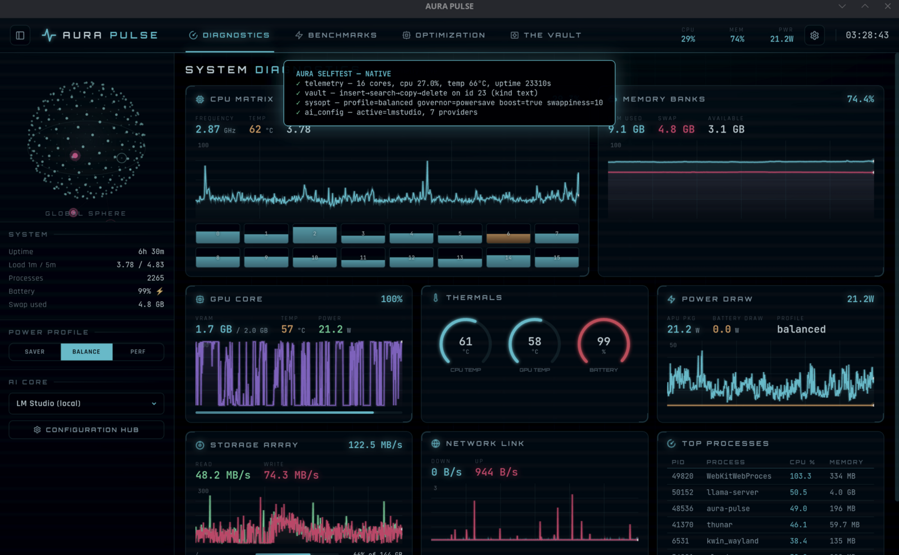

# Aura Pulse

**System telemetry · AI clipboard vault · hardware benchmarks — in a Tron-grade cockpit.**

A native Linux desktop app built with Tauri 2: a Rust backend samples your hardware at 10 Hz and guards a SQLite clipboard vault, while a dependency-light TypeScript frontend renders it as a cyberpunk control room.



## Views

- **Diagnostics** — live CPU matrix (per-core load + frequency + temp), memory banks, GPU core, thermals, power draw, storage array, network link and top processes. Sampled at 10 Hz straight from `/proc` and `/sys`, no shelling out in the hot path.
- **Benchmarks** — CPU (single/multi-core), memory bandwidth, disk throughput, plus an **LLM performance estimator** that projects local-model token speeds from measured memory bandwidth and probes a running Ollama for real numbers.
- **Optimization** — power profiles (via `power-profiles-daemon`), CPU boost toggle, swappiness, cache dropping. Privileged writes go through `pkexec` — the standard system auth dialog, no root daemon.
- **The Vault** — clipboard history (text + images) persisted in SQLite, with search, pinning, kind filters and AI enrichment: summarize, OCR, describe, convert to markdown or design JSON — using your configured provider.
- **AI Core** — multi-provider hub: OpenAI, Anthropic, Gemini, DeepSeek, Xiaomi MiMo, Ollama and LM Studio (local), or any OpenAI-compatible endpoint. All calls happen in Rust; keys never touch the webview DOM.

## Stack

| Layer | Tech |
|-------|------|
| Shell | Tauri 2 (webkit2gtk) |
| Backend | Rust — `sysinfo`-free hand-rolled telemetry, `rusqlite`, `arboard` (+ `wl-paste` fallback), `reqwest` |
| Frontend | TypeScript + Vite, zero UI frameworks — hand-built charts on `<canvas>` |
| Storage | SQLite vault at `~/.local/share/aura-pulse/`, AI config at `~/.config/aura-pulse/ai.json` (mode 0600) |

## Install

**npm** (Linux x64 — ships a prebuilt binary):

```bash
npm install -g aura-pulse
aura-pulse
```

Runtime deps: `libwebkit2gtk-4.1-0` and GTK 3 (preinstalled on most desktop distros). For start-menu integration and dependency handling, prefer the `.deb` below.

**macOS / Windows**: prebuilt installers (`.dmg` for Apple Silicon, `.exe`/`.msi` for
Windows) are published on the [Releases page](https://github.com/milodule3-debug/aura-pulse/releases).
See [docs/WINDOWS.md](docs/WINDOWS.md) for Windows-specific build/install notes.

## Build & run

Requirements: Node ≥ 18, Rust stable, and the [Tauri 2 Linux prerequisites](https://tauri.app/start/prerequisites/) (webkit2gtk 4.1 et al.).

```bash
npm install
npm run tauri dev      # development, hot reload
npm run tauri build    # release: .deb + .AppImage in src-tauri/target/release/bundle/
```

Install the built package:

```bash
sudo apt install ./src-tauri/target/release/bundle/deb/"Aura Pulse"_*_amd64.deb
```

Optional runtime helpers: `power-profiles-daemon` (power profiles), `wl-clipboard` (Wayland clipboard fallback), a local [Ollama](https://ollama.com) or LM Studio for free AI enrichment.

## Development notes

- `npm run typecheck` — strict TS check; `cargo check` inside `src-tauri/` for the backend.
- The frontend runs in a plain browser too (`npm run dev`) with a full mock backend — handy for UI work without Rust.
- Dev-only integration selftest: create `public/selftest.flag` and run `npm run tauri dev`; results render on-screen inside the real app.

See [CHANGELOG.md](CHANGELOG.md) for release history and [docs/ROADMAP.md](docs/ROADMAP.md) for the original feature spec.
